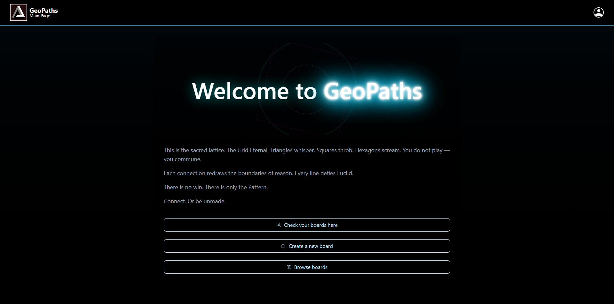
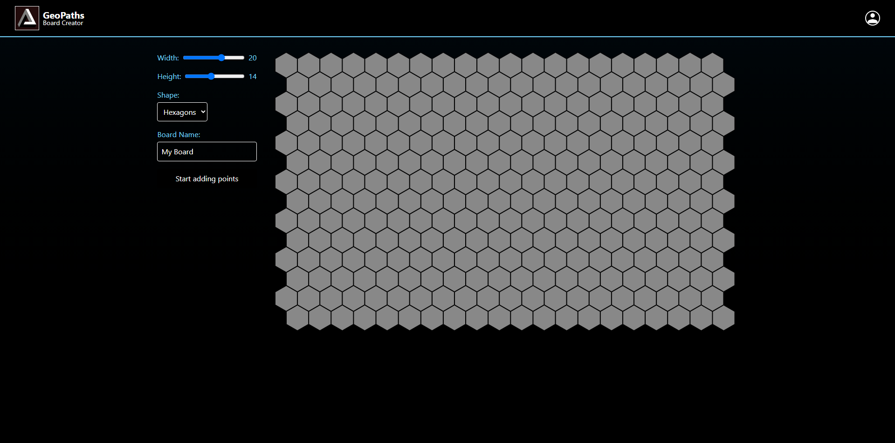
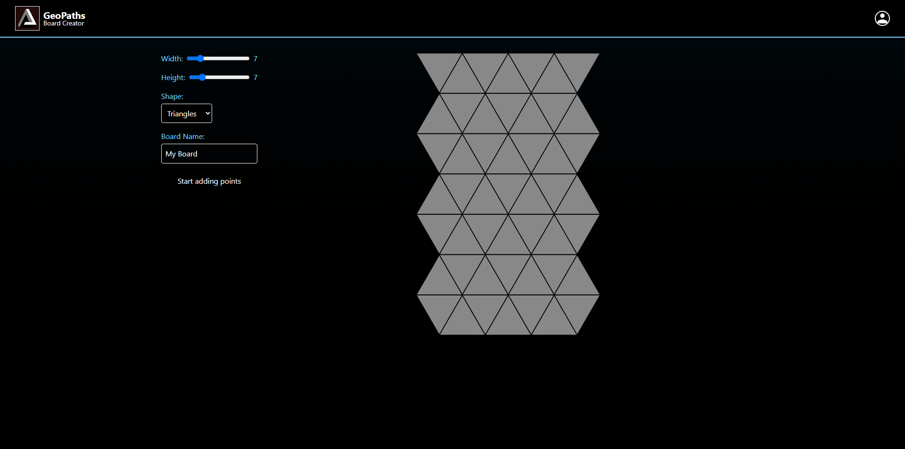
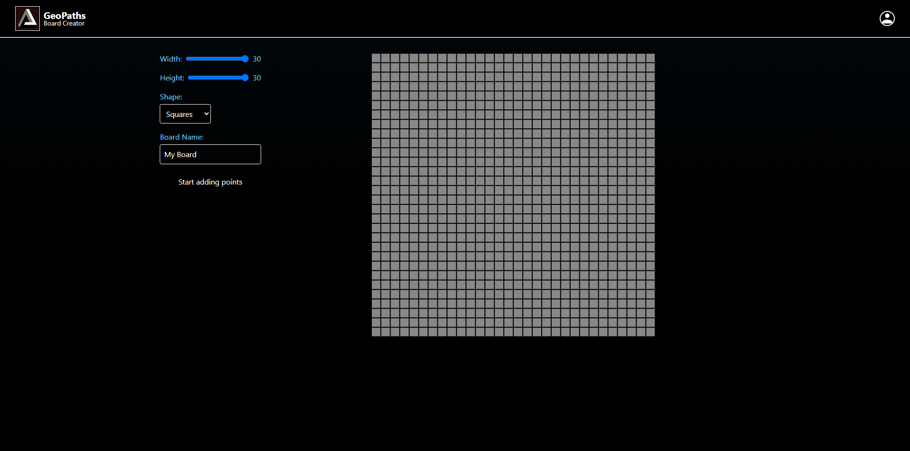
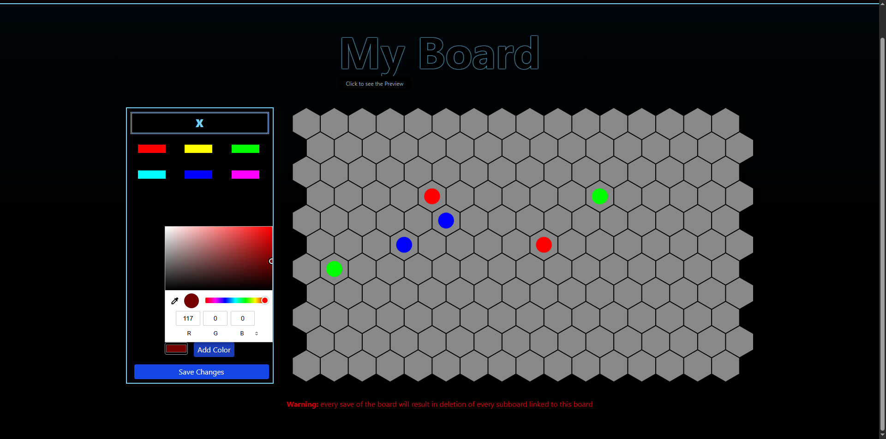
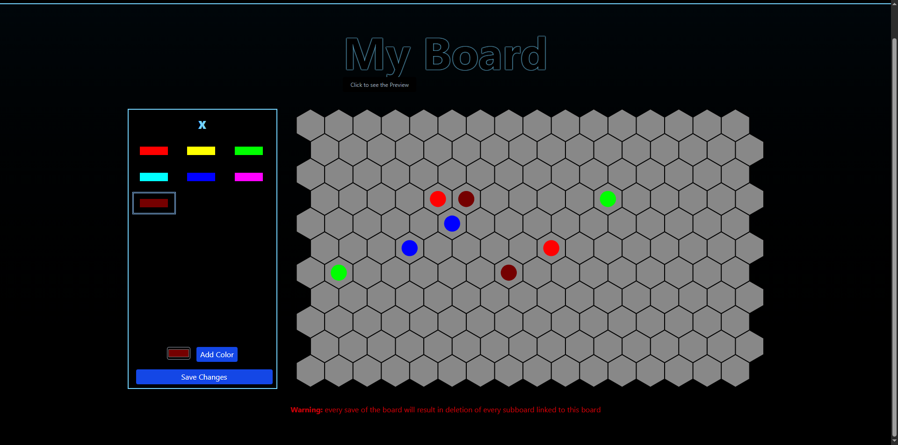
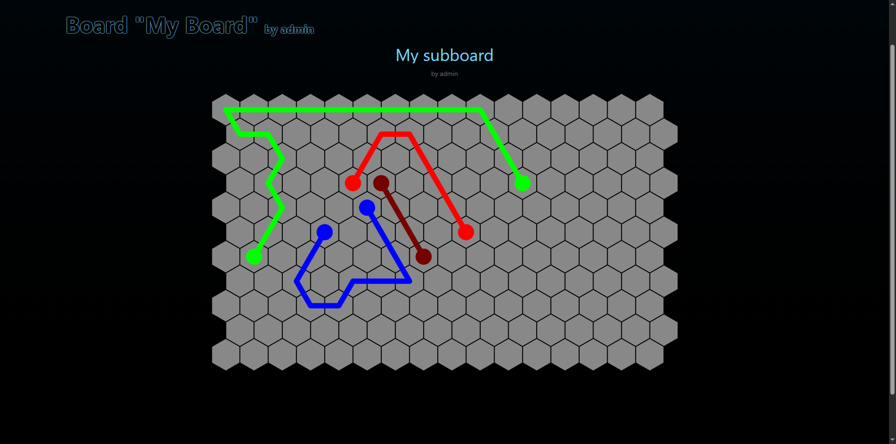
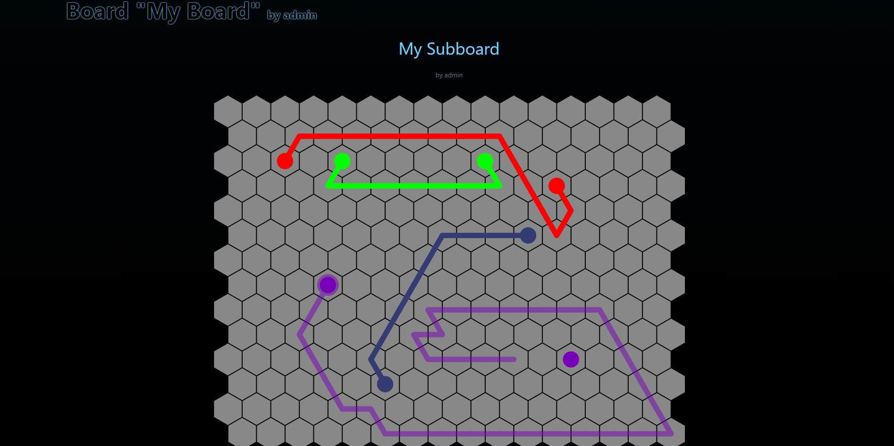

## Set up

#### Tested on python-3.13.3

#### Install dependencies:

  ```
  pip install "Django==5.2", django-tailwind[reload]
  ```

#### To run tailwind:
  
  Besides running `python manage.py runserver`, also run

  ```bash
  python manage.py tailwind start
  ```

  in the same directory, concurrently.

#### To run **tsc**:

  Run
  ```bash
  npm run watch
  ```


## Features

### Board creator

- Customize board dimensions: set **width** and **height**

- Select tiling type: triangle, square, or hexagon

- Place color-coded points anywhere on the board

- Boards are automatically saved

### Subboard creator:

- Select an existing board to build upon

- Create paths between points using left-click and hover

- Remove paths by right-clicking on them


## Screenshots


















